# Capstone Project 1 - Maven Global Electronics Retail Analysis

## 📋 Table of Contents

1. [Project Overview](#project-overview)
2. [Objectives](#objectives)
3. [Dataset Description](#dataset-description)
4. [Tools Used](#tools-used)
5. [Data Cleaning and Preparation](#data-cleaning-and-preparation)
6. [SQL Analysis](#sql-analysis)
7. [Power BI Dashboard](#powerbi-dashboard)
8. [Key Insights](#key-insights)
9. [Recommendations](#recommendations)
10. [screenshots](#screenshots)
11. [About the Author](#about-the-author)

### Project Overview

This project analyzes global electronics retail sales to uncover insights on revenue, top selling products, customer trends and regional performance.
The analysis follows a full data analytical workflow:

1. **Excel** -> data cleaning, validation, missing value handling
2. **SQL** -> multi-table analysis, joins, aggregations, KPIs
3. **Power BI** -> visualizing sales trends, product performance and regional insights
4. **ChatGPT** for assistance

### Objectives

The primary goal of this project is to provide a data-driven understanding of global electronics retail performance. Using the Sales, Customers, Products, Stores, and Exchange Rates datasets, the project aims to uncover insights that inform strategic and operational decisions.

1️⃣ Executive Perspective

For the board of executives, the focus is on high-level performance metrics and key trends:

- Track total revenue across all regions and markets.

- Identify top-performing countries and continents in terms of sales.

- Highlight top-selling product categories and brands.

- Provide KPIs such as average order value, revenue growth rate, and top stores by revenue.

- Offer strategic insights to support investment, expansion, or market prioritization decisions.

2️⃣ Manager Perspective

- For operational managers, the objective is to enable actionable insights to optimize store and product performance:

- Monitor store-level performance, including revenue per square meter.

- Identify high- and low-performing product categories and subcategories.

- Analyze customer behavior, including repeat purchase rates, demographic trends, and regional preferences.

- Provide recommendations for promotions, inventory allocation, and targeted marketing campaigns.

3️⃣ Analyst Perspective

From an analyst’s perspective, the goal is to explore patterns, trends, and relationships in the data to explain business outcomes:

- Analyze revenue trends over time (monthly, quarterly) and detect seasonal patterns.

- Measure product-level performance and profit margins.

- Assess the impact of currency fluctuations on global sales.

- Investigate customer purchasing behavior and segment performance.

- Link insights to actionable recommendations for management and executives.

**Overall Objective**
***This project seeks to bridge data insights with business decisions, providing a clear, actionable understanding of global electronics retail operations from multiple perspectives: strategic (executives), operational (managers), and analytical (analyst).***

### Dataset Description

The dataset used in this project comes from a global electronics retail business and contains transactional, customer, product, and store-level information.
It covers sales orders, product details, customer demographics, store characteristics, and currency exchange rates.
The dataset allows for multi-dimensional analysis of sales performance, customer behavior, and store operations.

#### Tables Overview

1. **Sales**
   - Contains transactional data for each order and line item.
   - Key fields: `order_number`, `line_item`, `order_date`, `delivery_date`, `customer_key`, `store_key`, `product_key`, `quantity`, `currency_code`.

2. **Customers**
   - Contains demographic details of customers.
   - Key fields: `customer_key`, `name`, `gender`, `city`, `state`, `zip_code`, `country`, `continent`, `birthday`.

3. **Products**
   - Contains information about products sold.
   - Key fields: `product_key`, `product_name`, `brand`, `color`, `unit_cost_usd`, `unit_price_usd`, `subcategory`, `category`.

4. **Stores**
   - Contains information about stores.
   - Key fields: `store_key`, `store_name`, `country`, `state`, `square_meters`, `open_date`.

5. **Exchange Rates**
   - Contains daily currency exchange rates against USD.
   - Key fields: `date`, `currency`, `exchange`.

#### Notes on Data Quality

- Some date fields were in inconsistent formats and were standardized to ISO format (YYYY-MM-DD).
- Currency columns contained symbols and were cleaned to numeric values.
- Some missing values in `square_meters` and `zip_code` columns were handled appropriately.
- `Order Number` is not unique per row because multiple line items can exist per order.

### Tools Used

1. `Microsoft Excel`
2. `SQL (PostgreSQL)`
3. `Microsoft Power BI`
4. `Python`
5. `ChatGPT`

### Data Cleaning and Preparation

Before analysis, the dataset underwent cleaning and preparation to ensure consistency, accuracy, and reliability. This was achieved using `MS Excel Power Query` and `SQL`.
This included handling missing values, correcting inconsistent formats, standardizing data types, and validating the integrity of relationships between tables.

#### Key Cleaning and Preparation Steps

1. **Date Columns Standardization**
   - Date fields in `Customers`, `Sales`, and `Exchange Rates` tables were in multiple formats (e.g., DD/MM/YYYY, MM/DD/YYYY).
   - Using Excel and Power Query, all date columns were standardized to ISO format (YYYY-MM-DD) for consistency.

2. **Handling Missing Values**
   - Some numeric fields like `square_meters` in `Stores` and `zip_code` in `Customers` contained missing values.
   - Missing values were either filled with a default (e.g., 0 for store size) or left as `NULL` depending on business logic.

3. **Cleaning Currency Columns**
   - `Unit Cost USD` and `Unit Price USD` in `Products` contained `$` symbols and extra spaces.
   - Power Query was used to remove symbols and convert columns to numeric type.

4. **Primary Key Adjustments**
   - `Order Number` in the `Sales` table was not unique because orders can have multiple line items.

5. **Data Type Conversion**
   - Text fields were validated for consistency (e.g., state codes, country names).
   - Numeric fields were checked for correct formatting and range.

6. **Consistency Checks**
   - Cross-validated foreign keys:
     - `Sales.customer_key` exists in `Customers`
     - `Sales.product_key` exists in `Products`
     - `Sales.store_key` exists in `Stores`
   - Ensured no orphan records exist.

#### Outcome

- All tables are now clean and ready for analysis.
- Dates, currency values, and numeric fields are standardized.
- Referential integrity is maintained across tables.
- The dataset is structured for SQL analysis and easy visualization in Power BI.

#### Screenshots

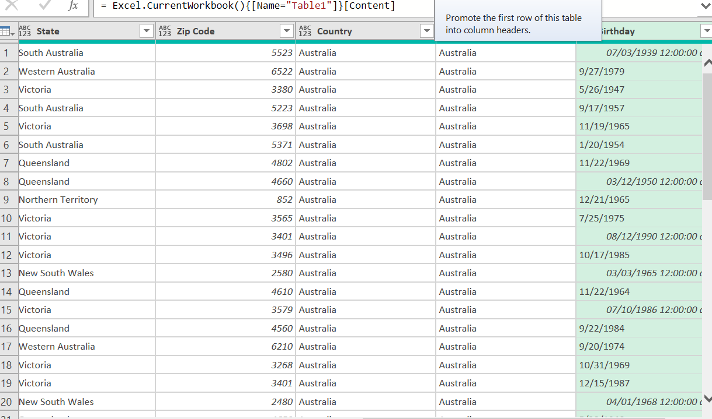
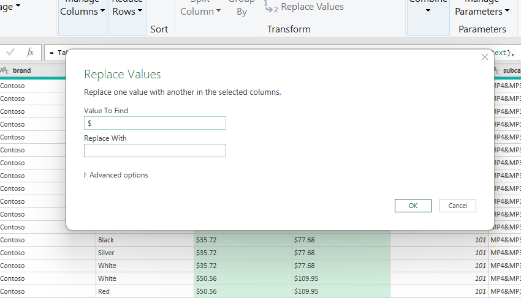
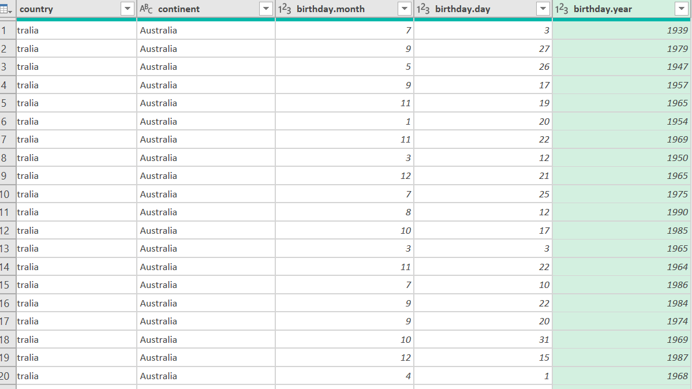

## SQL Analysis

### Tech Stack & Tools

***SQL Engine***

- **PostgreSQL 16** - Used for all relational data modeling, querying, indexing and analytical SQL functions

***Python Integration***

- **Jupyter Notebook** with the **PostgreSQL magic command (%%sql)** to run SQL queries directly inside python
- Used the PostgreSQL conection string to connect to the database and execute queries seamlessly

### Database Setup Process

1. **Created PostgreSQL Database**

- Created a new database using **pgAdmin 4**
- named the database according to the project (Maven_electronics)

2. **Connected to PostgreSQL Using Python**

- Established a connection in jupyter notebook using:
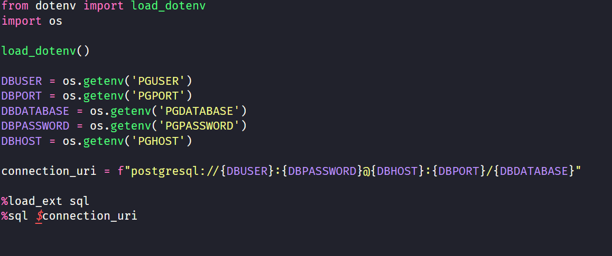

3. **Created Tables**

- Defined table schemas using `CREATE TABLE` statements
- Ensured each table had:
  - Primary Keys (PK)
  - Foreign Keys (FK)
  - Appropriate data types
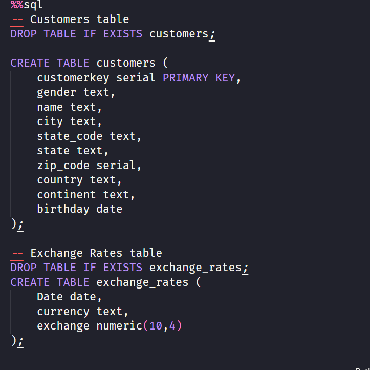
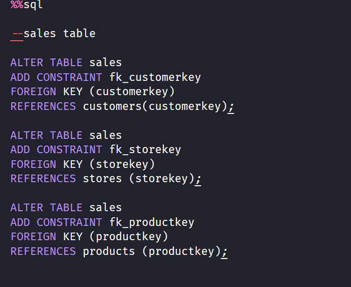

4. **Imported CSV Datasets**

- Loaded CSV files into PostgreSQL using:
  - `COPY` command inside SQL
  - Verified rows using `SELECT COUNT(*) FROM table_name;`.
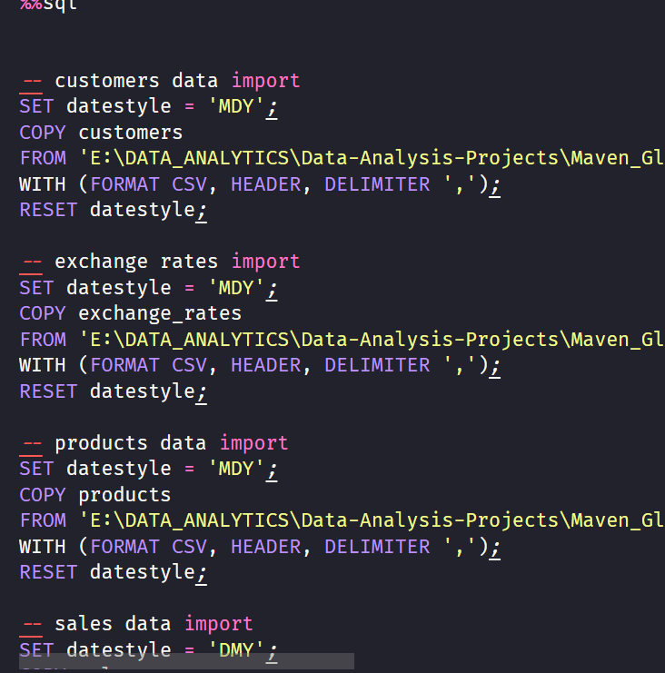

5. **Recommendations**

#### Executive-Level Insights

1. ***North America is the Cash Cow***
   * Contributes `58%` of total revenue `($12.92M out of $22.1M)`
   * United States alone = `$11.44M (52% of global revenue)`.

      **Action**: Prioritize inventory, marketing budget, and logistics investments in the US. Any supply-chain disruption here directly hits more than half your profit.

2. **Online Channel is Now the #1 Store**
   * Online revenue = `$4.42M` → bigger than any single country except the United States.
   * Beats the best physical store (Kansas) by almost 7×.

      **Action:** Aggressively shift budget from underperforming physical stores to e-commerce. Target 30–40% of total revenue from online within 2 years (very achievable).

3. **Adventure Works is the Golden Brand**
   * $4.56M revenue → 20.6% of company total
   * Ranks #1 in revenue AND #4 in units sold → high-ticket + decent volume
   * Their desktop PCs and 52" LCD TVs dominate the top-10 product list

      **Action:**
   - Negotiate exclusive models or co-branding deals with Adventure Works.
   - Run “Adventure Works Month” promotions across all channels
   - Feature them heavily on homepage and online ads

4. **Contoso Owns Volume – Use It for Customer Acquisition**
   * 19,186 units sold → almost 2× the next brand
   * Lower average selling price → perfect entry-level brand

      **Action**: Use Contoso water heaters, laptops, and accessories as loss-leaders or bundle items to bring new customers in, then upsell Adventure Works / WWI premium products.

5. **Average Order Value of $2,219 is Exceptionally High**
   * Driven by big-ticket items (desktop PCs, large TVs, water heaters)

      Action: Protect and grow AOV by:
      - Bundling (PC + monitor + warranty)
      - Cross-selling extended warranties and installation services

6. **Screenshots snippets**

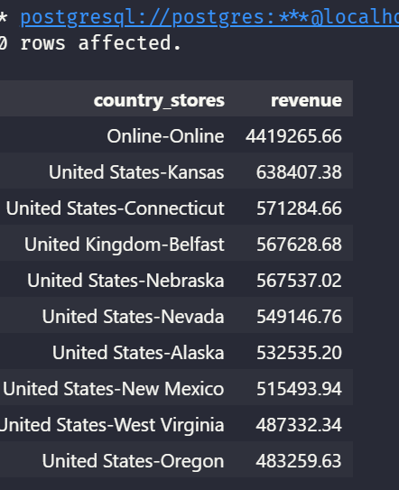
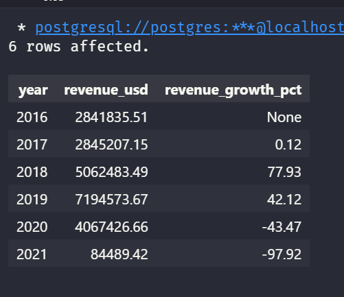
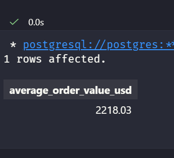
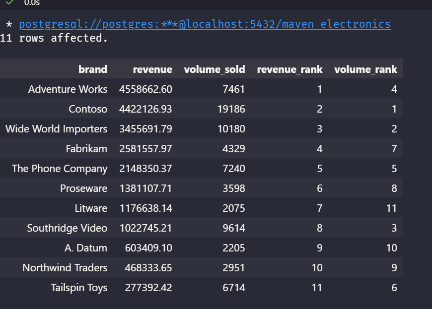
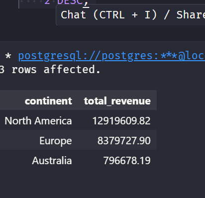
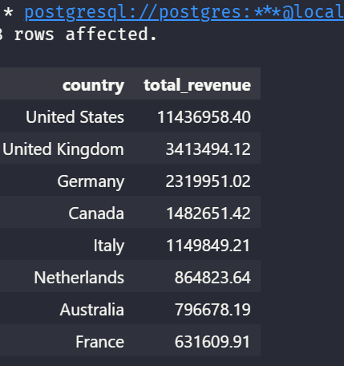